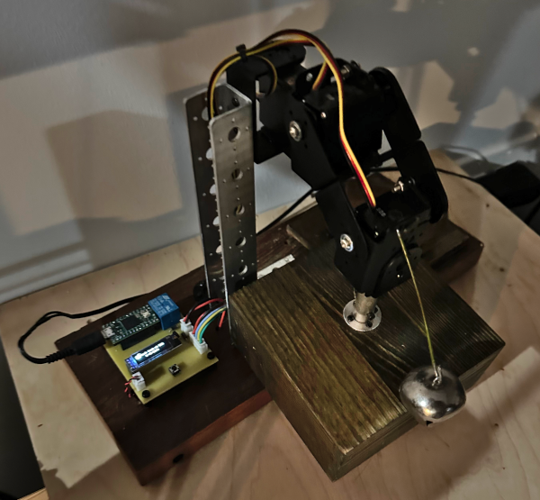
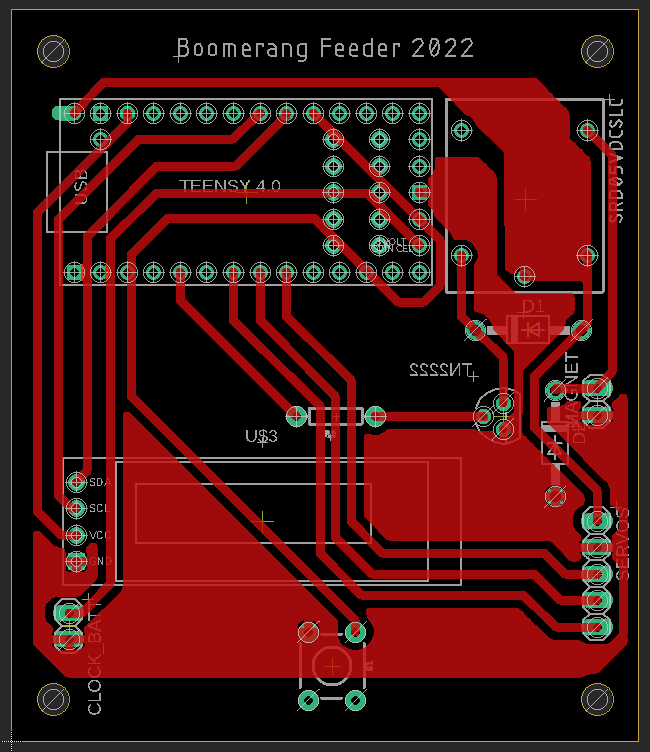

# TeensyCatFeeder

Instructions for an Teensy 4.0 controller to lock a cover over a catfood dish with an electromagnet when a button is pressed, and to move a servo arm to reveal the catfood (and ring a bell) at a scheduled time in the morning.

This is a project that I originally did using Raspberry Pi, then ported to ESP32, then to Teensy.  Hardware consists of the microcontroller, a 5V relay with a transistor circuit to control the electromagnet, a button, and a small LCD display.

 

There are three servos connected in an arm that hold the lid (a wood box) over dish with catfood. See [sketch.png](sketch.png).  In the code, the servos are named Shoulder, Elbow and Wrist.  See [ServoControl.ino](ServoControl.ino).  Their relative positions are saved in non-volatile memory on the controller using the [Preferences.h](https://github.com/espressif/arduino-esp32/tree/master/libraries/Preferences) library. See [SavingPrefs.ino](SavingPrefs.ino).

There is only one button, so it is hopelessly overloaded.  A short press either opens the feeder or locks the magnet, depending upon current state.  A long press cycles through current time and feeding time, so they can be set.  You can also connect the feeder to a computer and set these values via the serial monitor.  Sending a `p` over the serial port should show the current values, as well as the following menu:

`o - Open the lid`
`l - Lock or unlock magnet (1 or 0)`
`s - Move shoulder to x`
`e - Move elbow to x`
`w - Move wrist to x`
`j - Save number of jiggles to x`
`t - Save wake time as x (HHMM) - 0 = off`
`d - Save clock date as x (YYYYMMDD)`
`c - Save clock time as x (HHMM)`
`b - Save as new open`
`p - Print all values`
